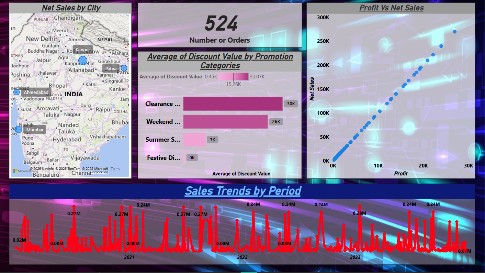
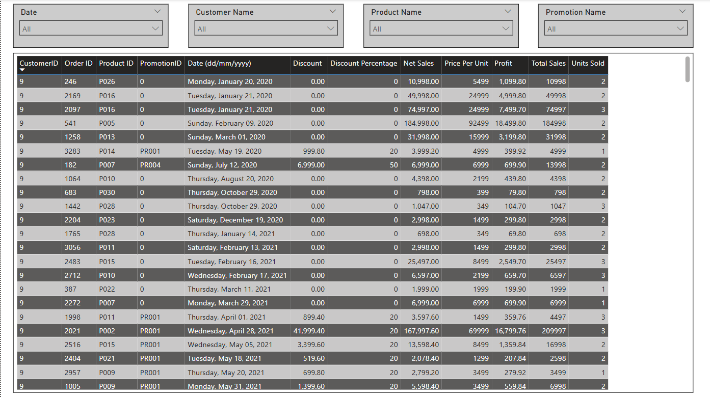
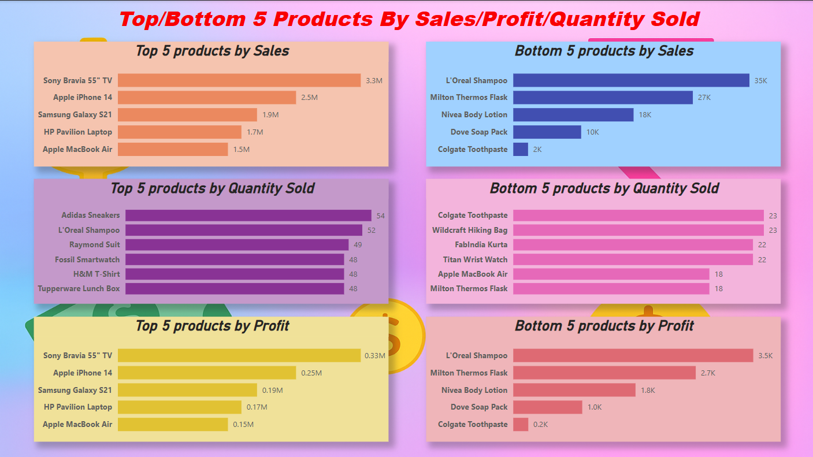

# ⚡ ELECTROHUB - Sales Data Analysis (Power BI Project)

## 📝 Project Overview

**Electrohub** is a retail store that offers a wide range of consumer products. This Power BI project focuses on analyzing the store's sales performance and extracting valuable business insights from the data.

The dashboard helps decision-makers explore sales, profit, discount behavior, and other metrics across various dimensions such as product categories, time periods, cities, and individual orders.

---

## 🛍️ Product Categories Analyzed

- Electronics  
- Footwear  
- Clothing  
- Home Appliances  
- Accessories  
- Kitchenware  
- Bags  
- Personal Care  

---

## 🎯 Business Objectives & KPIs

The dashboard answers the following key business questions:

1. **🔝 Top/Bottom 5 Products**  
   Identify the top and bottom 5 products based on:
   - **Sales**
   - **Profit**
   - **Quantity Sold**

2. **📈 Sales Trend Over Time**  
   Analyze how sales vary over time on:
   - **Daily**
   - **Monthly**
   - **Quarterly**
   - **Annual** basis

3. **📊 Relationship Between Sales & Profit**  
   Visualize correlation between **sales and profit** to find profitable and unprofitable sales activities.

4. **🔄 Period Comparison**  
   Compare **sales**, **profit**, and **quantity sold** between any **two user-selected time periods**.

5. **🏷️ Discount Analysis**  
   Show **average discount offered** within each **discount category**.

6. **📦 Order Summary**  
   Display the **total number of orders** in the dataset.

7. **🧾 Order-Level Detail & Filtering**  
   Display full order-level data including:
   - **Sales**, **Profit**, **Discount**, **Net Sales**, **Quantity Sold**, etc.
   Visual filtering enabled on:
   - Product  
   - Date  
   - Customer ID  
   - Promotion Categories  

8. **🌆 City-Wise Sales**  
   Show **sales distributed by cities** to identify strong and weak performing regions.

---

## 📂 Repository Structure

```
/ELECTROHUB-Sales-Analysis/
│
├── ELECTROHUB - Sales Data Analysis.pbix     # Power BI dashboard file
├── assets/
│   ├── intro-kpis.png                         # Overview and KPI introduction
│   └── questions.png                          # Detailed list of business questions
├── README.md                                  # Project documentation
```

---

## 🧰 Tools & Technologies

- **Power BI Desktop**
- **DAX (Data Analysis Expressions)**
- **Power Query (M Language)**
- Visual Elements: Bar Charts, Line Graphs, KPI Cards, Slicers, Drilldowns

---

## 📊 Sample KPIs Visualized

- Total Sales  
- Net Profit  
- Quantity Sold  
- Average Discount  
- Total Number of Orders  
- Sales Growth (Time-based)  
- Top/Bottom Product Rankings  
- City-wise Sales Distribution  

---

## 🖼️ Dashboard Snapshots

Here are a few screenshots showcasing the dashboard's analysis and visuals:


```

(assets/req_4.png)

```

---

## ✅ How to Use

1. Clone or download this repository.
2. Open `ELECTROHUB - Sales Data Analysis.pbix` in **Power BI Desktop**.
3. Navigate through different report pages and apply filters/slicers for dynamic insights.
4. Modify or expand the dashboard based on your specific needs or new data.

---

## 📧 Contact

For questions, improvements, or collaboration opportunities:  
**GitHub**: [https://github.com/SamarthDS](https://github.com/SamarthDS)  
**Email**: samarthdudi04@gmail.com

---
